# sim2real Pipeline Workflow

Four scripts run in sequence: **setup** → **prepare** → **deploy** → **analyze**.

## High-Level Pipeline

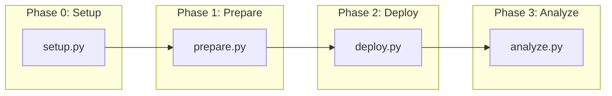

---

## setup.py — One-Time Environment Bootstrap

Idempotent. Creates namespace, secrets, PVCs, and deploys Tekton tasks.
Safe to re-run.

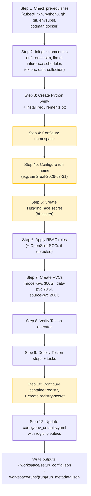

**Legend:**
- Yellow = human interactive input (namespace, tokens, registry credentials)

**Inputs:** CLI flags, environment variables, or interactive prompts
**Outputs:** `workspace/setup_config.json`, `workspace/runs/{run}/run_metadata.json`

---

## prepare.py — Extract, Translate, Generate, Build/Test, Review

The core AI-driven phase. Extracts the algorithm, maps signals, generates a
production scorer plugin, builds/tests it, and runs multi-model AI review.

### Stage 1: Extract

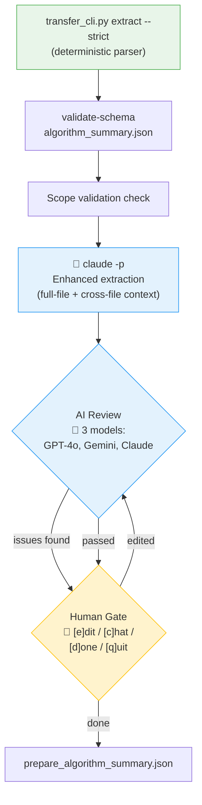

**Inputs:**
- `blis_router/best/` (EVOLVE-BLOCK source, experiment info)
- `docs/transfer/blis_to_llmd_mapping.md`

**Outputs:**
- `prepare_algorithm_summary.json` — signals, weights, cross-file deps

### Stage 2: Translate

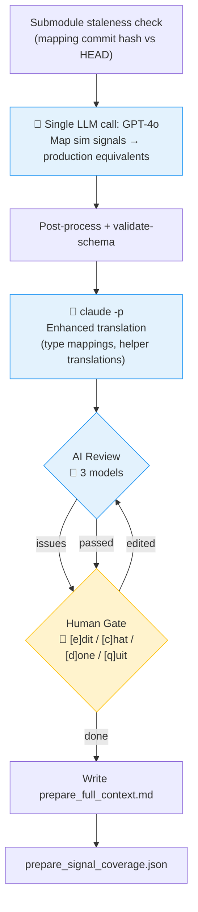

**Inputs:**
- `prepare_algorithm_summary.json` (from Stage 1)
- `docs/transfer/blis_to_llmd_mapping.md`

**Outputs:**
- `prepare_signal_coverage.json` — signal→production mapping with access paths
- `prepare_full_context.md` — combined context for downstream stages

### Stage 3: Generate (Writer + Reviewer Loop)

The most complex stage. An LLM writes the plugin code, the code is built and
tested, then 3 reviewer models check translation fidelity. Issues feed back
into the next round.

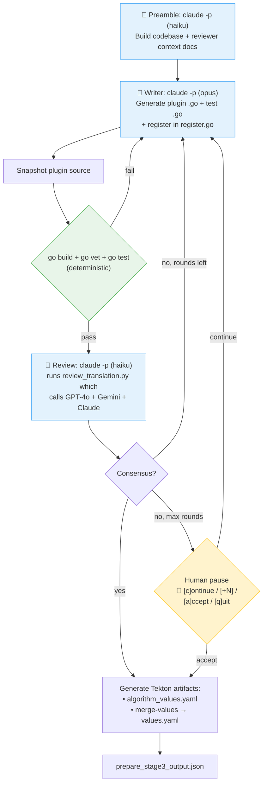

**Inputs:**
- `prepare_algorithm_summary.json`, `prepare_signal_coverage.json`
- `docs/transfer/scorer_template.go.md`, example plugins
- `config/env_defaults.yaml`, `blis_router/llm_config.yaml`

**Outputs:**
- Plugin `.go` file in `llm-d-inference-scheduler/pkg/plugins/scorer/`
- `prepare_stage3_output.json`
- `prepare_tekton/algorithm_values.yaml`, `prepare_tekton/values.yaml`

### Stage 4: Build/Test + Equivalence Gate

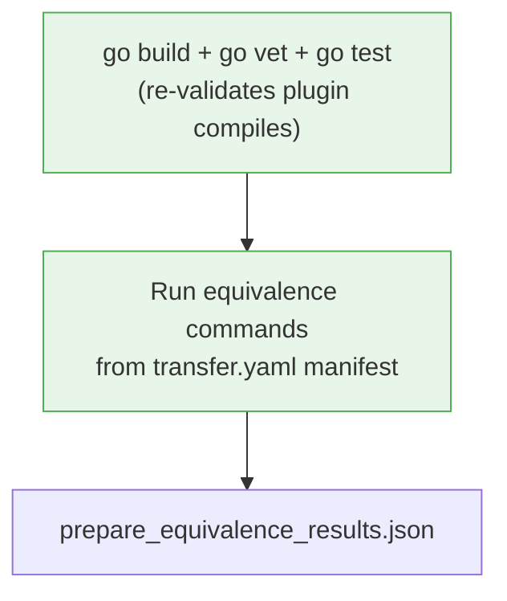

### Stage 5: Final Review

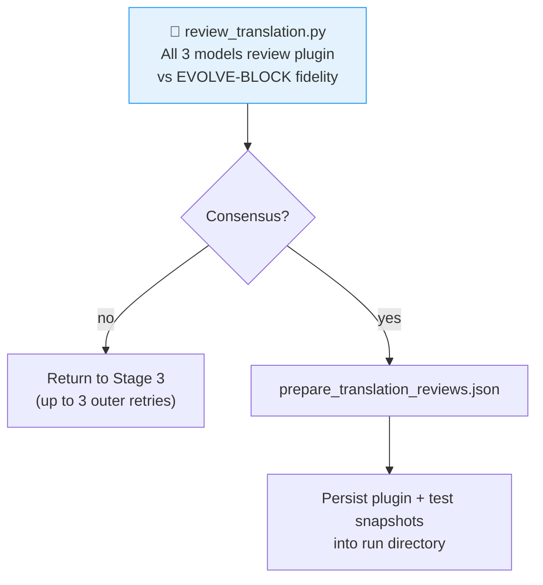

**Final prepare.py outputs** (all in `workspace/runs/{run}/`):
| Artifact | Description |
|----------|-------------|
| `prepare_algorithm_summary.json` | Extracted algorithm metadata |
| `prepare_signal_coverage.json` | Signal→production mapping |
| `prepare_stage3_output.json` | Plugin file paths, Tekton artifact paths |
| `prepare_equivalence_results.json` | Equivalence gate results |
| `prepare_translation_reviews.json` | Final AI review consensus |
| `prepare_scorer_snapshot.go` | Frozen copy of generated plugin |
| `prepare_tekton/values.yaml` | Merged Tekton pipeline values |

---

## deploy.py — Build EPP, Cluster Benchmarks, PR

Builds the treatment container image, runs real cluster benchmarks via Tekton
pipelines, and optionally creates a PR.

### Stage 1: Build EPP Image

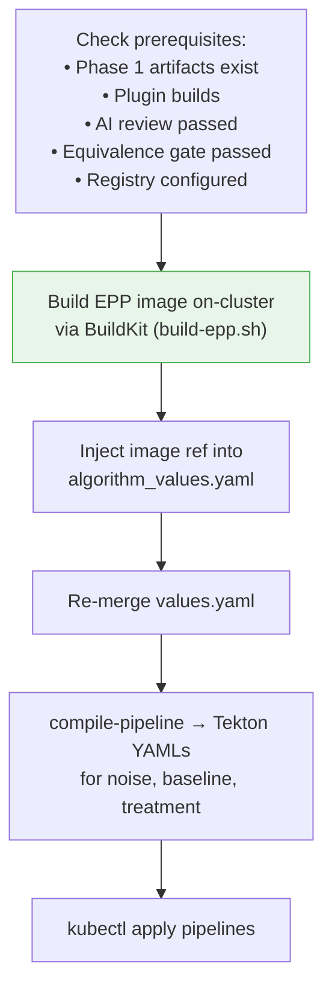

### Stage 2: Cluster Benchmarks

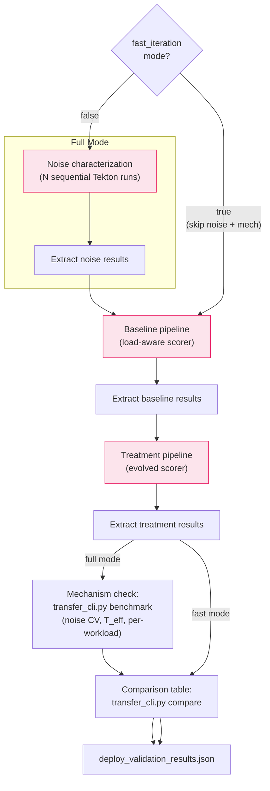

Pink = runs on Kubernetes cluster via Tekton pipelines (blis observe against live vLLM)

### Stage 3: PR Creation (if --pr and not fast_iteration)

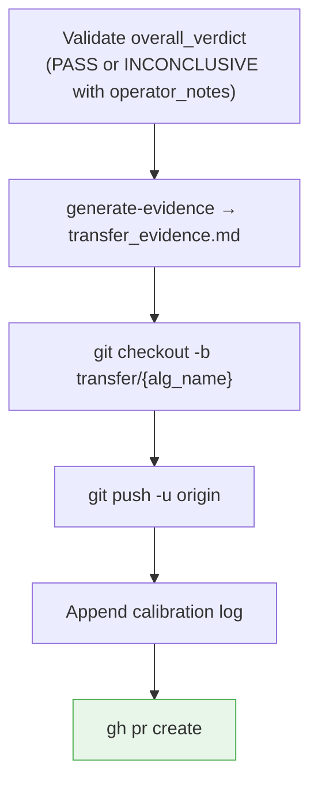

**deploy.py outputs** (all in `workspace/runs/{run}/`):
| Artifact | Description |
|----------|-------------|
| `deploy_baseline_results.json` | Baseline latency metrics per workload |
| `deploy_treatment_results.json` | Treatment latency metrics per workload |
| `deploy_noise_results.json` | Noise characterization (full mode only) |
| `deploy_benchmark_output.json` | Mechanism check verdict (full mode only) |
| `deploy_validation_results.json` | Overall verdict (PASS/FAIL/INCONCLUSIVE) |
| `deploy_comparison_table.txt` | Human-readable latency comparison |

---

## analyze.py — Latency Comparison Charts

Post-processing script that generates visual charts from deploy artifacts.
No LLM involvement — purely deterministic.

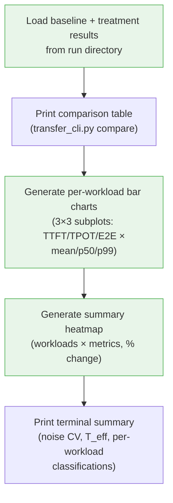

**Inputs:** `deploy_baseline_results.json`, `deploy_treatment_results.json`, `deploy_validation_results.json`
**Outputs:** `results_charts/workload_*.png`, `results_charts/summary_heatmap.png`

---

## End-to-End Data Flow

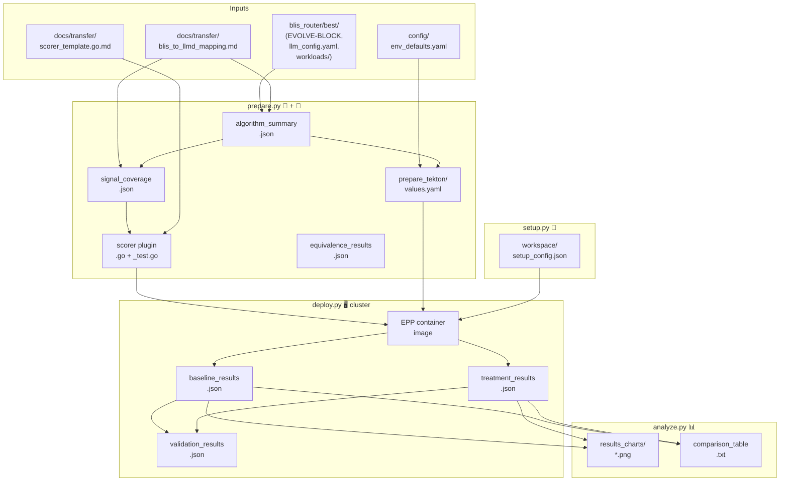

---

## Actor Legend

| Symbol | Actor | Where |
|--------|-------|-------|
| 🤖 | LLM (claude -p, GPT-4o, Gemini, Claude) | Extract enhance, Translate, Generate, Review |
| 👤 | Human operator | Setup prompts, review gates ([e]dit/[c]hat/[d]one), round pauses |
| 🖥️ | Kubernetes cluster (Tekton) | Noise/baseline/treatment benchmarks, EPP build |
| 📊 | Deterministic code (Python/CLI) | extract parser, validate-schema, merge-values, compare, charts |

### LLM Usage Summary

| Stage | LLM Role | Models Used |
|-------|----------|-------------|
| Extract (base) | None — deterministic parser | — |
| Extract (enhanced) | Full-file + cross-file context extraction | claude -p |
| Extract review | Check completeness | GPT-4o + Gemini + Claude |
| Translate (base) | Map sim signals → production paths | GPT-4o (single call) |
| Translate (enhanced) | Add type mappings, helper translations | claude -p |
| Translate review | Check coverage | GPT-4o + Gemini + Claude |
| Generate (context) | Build codebase + reviewer context docs | claude -p (haiku) |
| Generate (writer) | Write scorer plugin + test | claude -p (opus) |
| Generate (review) | Translation fidelity check via review script | GPT-4o + Gemini + Claude |
| Final review | Same as generate review | GPT-4o + Gemini + Claude |

### Human Touchpoints

| Where | What | Can Skip? |
|-------|------|-----------|
| setup.py | Namespace, tokens, registry credentials | Yes (CLI flags / env vars) |
| Extract gate | Review AI-extracted algorithm summary | Yes (`--no-gate`) |
| Translate gate | Review signal mapping | Yes (`--no-gate`) |
| Generate pause | Continue/accept after max review rounds | No (intentional) |
| Artifact reuse | Reuse vs regenerate existing artifacts | Yes (`--force`) |
